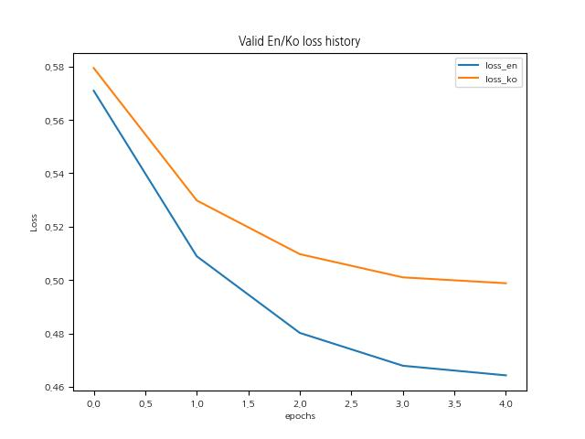
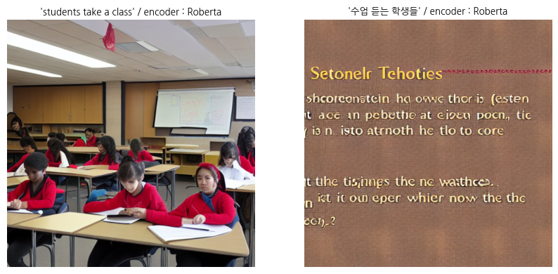

# K-Stable-Diffusion
한국어 텍스트로 이미지를 생성하는 모델을 만들어보는 프로젝트입니다. 


## 0. Results
학습전, 텍스트와 무관하고, bias가 많이 섞여있는 이미지를 생성


학습 후, 한국어 텍스트가 가지는 의미를 고려한 general한 이미지를 생성


영어텍스트 image 와의 비교


## 1. Motivation

텍스트로부터 이미지를 생성하는 대표적인 디퓨전 기반의 생성모델인 stable-diffusion을 웹에서 사용해보면서 (https://stablediffusionweb.com) 한국어 텍스트가 입력으로 주어졌을 때 여러가지 문제를 느낀적이 많았습니다.

1. 한국어의 문법이나 단어 등에 대한 학습이 거의 되어 있지 않음.
2. 거의 모든 한국어 텍스트 input에 대해 문맥과는 전혀 상관없는 동양인 인물이나 아시아 풍의 사진 등등 bias가 많이 섞인 이미지가 생성이 됨.

    

이런 문제가 생긴 이유는 stable-diffusion 학습에 사용된 데이터가 대부분 영어텍스트-이미지이고, 아주 조금의 한국어텍스트가 섞여있어 거기에 과적합된 것이라 생각했고, 이 모델에 한국어를 학습시켜 한국어 텍스트에 대해서도 bias가 섞이지 않은 general한 이미지를 생성하는 모델을 만들어 내는 것을 프로젝트 목표로 정했습니다.


## 2. Methods

허깅페이스에 stable diffusion 예제로 나오는 CompVis/stable-diffusion-v1-4 모델을 사용했고, 모델 구성은 다음과 같이 latent로부터 이미지를 생성하는 VAE / 텍스트에서 임베딩을 생성하는 text_encoder (CLIP) / diffusion process를 하는 Unet 입니다. 처음에는 (한국어텍스트-이미지) 데이터셋을 이용해 전체 모델에 대해서 학습을 해볼라고 했는데, 데이터셋을 구하기 쉽지 않고 Unet의 크기가 너무 커서 올릴수가 없었습니다. 


따라서 상대적으로 크기가 작고, 한국어에 대해 가장 효과적으로 학습이 될 수 있는 text encoder 만을 학습시키기로 했습니다. 데이터셋은 한국어-영어 번역 데이터를 이용해서, text encoder로 나오는 embedding 값에 대해서 한국어와 영어가 비슷한 embedding이 나오도록 학습을 해보는 방향으로 정했습니다.

관련 문서를 찾아보던 중, 이렇게 monolingual한 text-encoder에 대하여 knowledge distilation을 통해 multi-lingual하게 학습을 할 수 있다는 논문을 발견했습니다. (https://arxiv.org/pdf/2004.09813.pdf) 핵심은 원래의 text-encoder를 teacher model로, 새롭게 한국어와 영어를 학습시킬 다른 text-encoder를 student model로 둬, student model의 embedding을 teacher model의 embedding space로 가게 하는 것이었습니다. 


loss function을 다음과 같이 정의하고, student model로 여러가지를 해보면서 실험을 해봤습니다. 
```
loss_en = nn.MSE(embed_en, embed_gt)
loss_ko = nn.MSE(embed_ko, embed_gt)
loss = loss_en + loss_ko

#embed_en, embed_ko : student model에서 나온 영어, 한국어텍스트의 embedding
#embed_gt : teacher model에서 나온 영어텍스트에 대한 embedding
```

여러 시도와 시행착오를 했지만, 다음의 3가지가 유의미한 결과를 보여주었고 experiments에 정리를 해두었습니다. teacher model로는 기존의 clip text model을 사용했습니다. (huggingface : "openai/clip-vit-large-patch14")

1. student model : "openai/clip-vit-large-patch14" (clip text model)
    - teacher model과 똑같은 모델, (영어 text로 pretrained됨)
    - params : 123,060,080 (123M)
    - output_shape : `batch_size x 77(max_length) x 768`

2. student model : "klue/roberta-small" (roberta-ko)
    - 한국어에 대해 사전학습된 bert-base 모델 중 "CompVis/stable-diffusion-v1-4"과 hidden dimension 맞는 걸로 선택.
    - params : 68,090,880 (68M)
    - output shape : `batch_size x 77 x 768`, output 중 last hidden states를 사용.
    

3. student model : "klue/roberta-small" (roberta-ko), pooler ouput으로 loss 계산.
    - 2와 같은 모델이지만, output 중 CLS token에 해당하는 embedding만 loss로 계산
    - params : 68,090,880 (68M)
    - output shape : `batch_size x 1 x 768`
    - 원래 diffusion 모델에서는 Unet의 last hidden state를 입력으로 주지만, pooler output으로 loss를 계산하는 코드가 있었음. 


## 3. Datasets

1. 032.방송콘텐츠 한국어-영어 번역 말뭉치 : 587,082개
2. 한국어-영어 번역 말뭉치(기술과학) : 1,344,631개
3. 한국어-영어 번역 말뭉치(사회과학) : 1,361,845개
4. 한국어-영어 번역(병렬) 말뭉치 : 1,602,418개
AI hub에서 4가지 한국어/영어 번역 데이터셋을 사용했습니다. 데이터가 너무 많아서 로컬 환경에서 데이터셋을 정리헀습니다.


총 4,893,326개의 텍스트쌍이 있었지만 약 25만개의 text pair만을 학습시에 데이터로 사용하였습니다. 또한, duplicate, null, max_length 초과 텍스트 등을 제거하는 전처리를 진행했습니다. 

학습 시에 사용할 tokenize 할 때의 max_length는 원래 CompVis/stable-diffusion-v1-4에 맞춰 77로 정했고 모든 텍스트에 대해 일괄적용했습니다. 토크나이저 및 데이터셋과 관련해서는 `dataset.ipynb`로 정리했습니다.

## 4. Experiments

개발환경 및 hyperparameter는 다음과 같습니다.
```
# env
OS : Ubuntu20.04
GPU : RTX3060 (12GB)

# hyperparameter

epochs = 5
learning_rate = 5e-5
weight_decay = 1e-4
batch_size = 32
total_dataset = 250000

optimizer = AdamW(...)
scheduler = get_cosine_schedule_with_warmup(...)
```
과제4 코드를 참고해서 train 코드 및 데이터셋 코드를 작성하였고, 다음의 3가지 모델학습에서 유의미한 결과가 있다고 생각해 정리하였습니다. 3가지 모두 동일한 환경에서 학습을 진행하였습니다. 

1. student model : "openai/clip-vit-large-patch14" (clip text model)

    최저 valid loss 및 그래프
    ```
    TRAIN_EPOCH:4    global_step:31250 loss:0.5000
    VALIDATION       global_step:31250 loss:0.5647
    Train loss :    loss_en:0.0475 loss_ko:0.4526
    Valid loss :    loss_en:0.0694 loss_ko:0.4954
    ```
    <p align="center">
    
    
    <figcaption align="center">train/valid loss (좌), valid loss_en/loss_ko (우) </figcaption>
    </p>

    영어 텍스트에 대해서는 이미 학습이 되어 있기 때문에, 한국어 텍스트에 비해 훨씬 loss가 낮은 모습을 확인할 수 있습니다. 그렇게 때문에 영어에 비해 한국어 텍스트의 학습이 잘 안되는 경향이 있고 실제로 이미지 샘플에서도 영어 텍스트로 넣을 때 만큼 품질이 뛰어나지는 않았습니다. 그럼에도 다른 모델에 비해 성능이 가장 좋았고, 

    

    
    clip text model에는 한국어 tokenizer 및 vocab이 없어, 한국어에 대한 학습이 잘 안될 것이라고 생각을 했었는데 생각보다 잘 되는 것을 확인할 수 있었습니다. 다만 모델이 크고, knowledge distilation의 장점이 작은 student 모델로도 teacher 모델의 지식을 잘 배울 수 있다는 것인데 이 점을 활용하지 못한 것 같아 다음 학습에서는 clip text model이 아니라 절반 정도의 크기인 한국어 pretrained model인 roberta를 사용하여 학습했습니다.


2. student model : "klue/roberta-small" (roberta-ko)

    최저 valid loss 및 그래프
    ```
    TRAIN_EPOCH:4    global_step:31250 loss:0.9792
    VALIDATION       global_step:31250 loss:0.9631
    Train loss :    loss_en:0.4798 loss_ko:0.4995
    Valid loss :    loss_en:0.4643 loss_ko:0.4988
    ```
    <p align="center">
    
    
    <figcaption align="center">train/valid loss (좌), valid loss_en/loss_ko (우) </figcaption>
    </p>
    
    train/valid loss 모두 잘 감소하고, 이 말인 즉슨 teacher model의 embedding space로 잘 학습이 되고 있음을 확인할 수 있습니다. 또한, 한국어 text의 embedding에 대한 로스는 영어 text보다는 덜 학습이 되는 경향도 확인할 수 있었습니다.


    
    
    이미지 샘플에서도 완벽하지는 않지만, 텍스트의 의미를 어느정도 학습이 되고 있다는 것을 확인할 수 있었고, 같은 의미의 영어, 한국어 텍스트가 비슷한 임베딩을 갖도록 학습을 시켰는데 그에 맞게 이미지에서 나타나는 전체적인 색감이나 분위기가 비슷해 보였습니다. 다른 모델들에 비해 학습이 제대로 되고 있는 것 같아 batch size를 늘려 더 많이 (30 epochs) 학습시켰고, 그 결과 loss는 더 떨어지고 이미지 품질 역시 훨씬 좋았습니다.

    
    <br><br><br>

3. student model : "klue/roberta-small" (roberta-ko), pooler ouput으로 loss 계산.

    2번에서, loss를 계산할 때 encoder의 output 중에 last hidden state가 아니라 pooler output을 쓰면 학습이 더 빠르고, 전체적인 정보를 잘 반영하지 않을까? 라는 생각에 학습을 했습니다.

    ```
    TRAIN_EPOCH:4    global_step:31250 loss:1.0766
    VALIDATION       global_step:31250 loss:1.0813
    Train loss :    loss_en:0.5359 loss_ko:0.5406
    Valid loss :    loss_en:0.5319 loss_ko:0.5494
    ```
    <p align="center">
    
    
    <figcaption align="center">train/valid loss (좌), valid loss_en/loss_ko (우) </figcaption>
    </p>

    2번에 비해 유의미한 학습 속도의 차이는 없었고, 오히려 생각보다 loss가 잘 안떨어지고 valid loss가 수렴하는 타이밍도 빨랐습니다. 샘플이미지 역시 텍스트에 대해 유의미한 학습이 되었다고 볼 수 없는 이미지 였습니다. 실제로 이미지를 생성할 때 UNet에 들어가는 text embedding이 last hidden output이기 때문에, 2번에서한 학습보다는 학습이 잘 안되고 성능이 안나오는 것 같습니다.

    


## 5. Discussion / Conclusion

<p align="center">
    
    
</p>
<p align="center">
    
    
</p>
<p align="center">
    
    
</p>
<p align="center">
    
    
    <figcaption align="center"> encoder에 따른 이미지 생성결과 roberta(좌), clip(우) </figcaption>
</p>

두 모델 모두, 한국어에 대한 어느정도의 학습이 된 것을 확인할 수는 있지만 완전히 이해하고 있다고는 볼 수 없다. 복잡한 한국어나 데이터셋에 없는 단어에 대해서는 성능이 많이 부족한 모습이고, evaluation을 몇개의 문장으로 정성적으로 할 수 밖에 없어 이 모델들이 각각 어디까지의 성능을 보이고 한계가 어디인지도 확실히 할 수는 없었다. 또한, 구현 단계에서 미숙한 부분이 많기 때문에 그로 인한 문제가 있었을 수도 있다.

그럼에도 text encoder 학습만으로 한국어텍스트로 general한 이미지를 만들어보는 목표를 달성할 수 있었고, knowledge distilation을 이용하여 더 작은 모델로, 더 효율적인 학습을 할 수 있었다. 프로젝트를 하는 과정에서 huggingface나 pytorch, 이미지 라이브러리 등 여러 프레임워크에 익숙해졌고, stable diffusion에 대해서 어떻게 구현되고 개발되는지 이해할 수 있었다.  

데이터셋을 10000 -> 50000 -> 250000 로 늘려가면서 학습을 했었는데, 확실히 데이터셋이 많아짐에 따라 loss값 자체가 계속 떨어지는 것을 확인할 수 있었다. 시간이 부족해 더 늘릴 수는 없었지만, 부족한 한국어 성능은 더 많은 데이터셋과 더 많은 시간에 학습을 한다면 해결이 될 수 있을 것이라고 생각한다.
