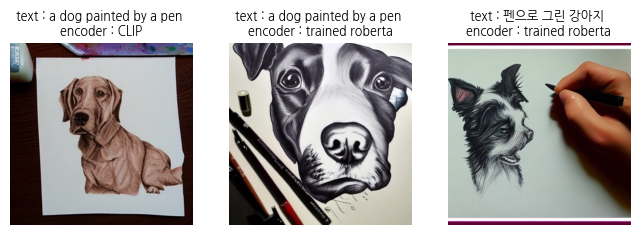
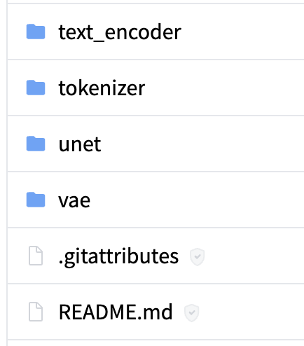

# K-Stable-Diffusion

한국어 텍스트로 이미지를 생성하는 모델을 만들어보는 프로젝트입니다. 

stable diffusion의 기존 text encoder인 CLIPTextModel의 embedding을 knowledge distilation을 이용해 기존의 모델보다 더 작은 roberta-small에 학습시켰습니다. 

기존의 영어 text에만 학습이 잘 되어있는 CLIPTextModel과는 다르게, 새로 학습시킨 roberta-small에서는 영어 뿐만 아니라 한국어에 대해서도 이미지를 잘 생성하는 모습을 확인할 수 있었습니다. 또한 기존 CLIPTextModel의 절반의 크기로 이에 상응하는 이미지를 생성할 수 있었습니다.

### results

- 기존 CLIPTextModel : 한국어 text에 대해 무관하고, bias가 많이 섞여있는 이미지를 생성

    

- 학습 전 roberta-samll : 이미지 생성에 맞는 embedding으로 학습이 되어있지 않아 이상한 이미지 생성

    

- 학습 후 roberta-samll : 한국어 텍스트에 대해 잘 맞는 이미지 생성

    

- 같은 의미의 영어 텍스트(CLIP, roberta), 한국어 텍스트 (roberta) 이미지 비교
    
    

- 다양한 결과
    <p>
    
    
    
    </p>


<br><br><br>


## 1. Motivation

텍스트로부터 이미지를 생성하는 대표적인 디퓨전 기반의 생성모델인 stable-diffusion을 웹에서 사용해보면서 (https://stablediffusionweb.com) 한국어 텍스트가 입력으로 주어졌을 때 여러가지 문제를 느낀적이 많았습니다.

1. 한국어의 문법이나 단어 등에 대한 학습이 거의 되어 있지 않음.
2. 거의 모든 한국어 텍스트 input에 대해 문맥과는 전혀 상관없는 동양인 인물이나 아시아 풍의 사진 등등 bias가 많이 섞인 이미지가 생성이 됨.


이런 문제가 생긴 이유는 stable-diffusion 학습에 사용된 데이터가 대부분 영어텍스트-이미지이고, 아주 조금의 한국어텍스트가 섞여있어 거기에 과적합된 것이라 생각했습니다.따라서 이 모델에 한국어를 학습시켜 한국어 텍스트에 대해서도 bias가 섞이지 않은 general한 이미지를 생성하는 모델을 만들어 내는 것을 프로젝트 목표로 정했습니다.

<br><br><br>

## 2. Methods

허깅페이스에 stable diffusion 예제로 나오는 'CompVis/stable-diffusion-v1-4'모델을 사용했고, 모델 구성은 다음과 같이 latent로부터 이미지를 생성하는 VAE / 텍스트에서 임베딩을 생성하는 text_encoder (CLIP) / diffusion process를 하는 UNet 입니다. 처음에는 (한국어텍스트-이미지) 데이터셋을 이용해 전체 모델에 대해서 학습을 해볼라고 했는데, 데이터셋을 구하기 쉽지 않고 UNet의 크기가 너무 커서 올릴수가 없었습니다. 


<p align="center">
    
    
    <figcaption align="center">latent diffusion / huggingface 'CompVis/stable-diffusion-v1-4'</figcaption>
</p>

따라서 상대적으로 크기가 작고, 한국어에 대해 가장 효과적으로 학습이 될 수 있는 text encoder 만을 학습시키기로 했습니다. 데이터셋은 한국어-영어 번역 데이터를 이용해서, text encoder로 나오는 embedding 값에 대해서 한국어와 영어가 비슷한 embedding이 나오도록 학습을 해보는 방향으로 정했습니다.

관련 문서를 찾아보던 중, 이렇게 monolingual한 text-encoder에 대하여 knowledge distilation을 통해 multi-lingual하게 학습을 할 수 있다는 논문을 발견했습니다. (https://arxiv.org/pdf/2004.09813.pdf) 핵심은 원래의 text-encoder를 teacher model로, 새롭게 한국어와 영어를 학습시킬 다른 text-encoder를 student model로 둬, student model의 embedding을 teacher model의 embedding과 비슷해지도록 학습을 하는 것이었습니다.

<p align="center">
    
    <figcaption align="center"></figcaption>
</p>


loss function을 다음과 같이 정의하고, student model로 여러가지를 해보면서 실험을 해봤습니다. 
```
loss_fn = nn.MSELoss()
loss_en = loss_fn(embed_en, embed_gt.detach())
loss_ko = loss_fn(embed_ko, embed_gt.detach())
loss = loss_en + loss_ko

#embed_en, embed_ko : student model에서 나온 영어, 한국어텍스트의 embedding
#embed_gt : teacher model에서 나온 영어텍스트에 대한 embedding
```

여러 시도와 시행착오를 했지만, 다음의 3가지가 유의미한 결과를 보여주었고 experiments에 정리를 해두었습니다. teacher model로는 기존의 CLIPTextModel을 사용했습니다. (huggingface, "openai/clip-vit-large-patch14")

1. student model : CLIPTextModel ("openai/clip-vit-large-patch14")
    - teacher model과 똑같은 모델, (영어 text로 pretrained됨)
    - params : 123,060,080 (123M)
    - output_shape : `batch_size x 77(max_length) x 768`

2. student model : RobertaModel ("klue/roberta-small")
    - 한국어에 대해 사전학습된 bert-base 모델 중 "CompVis/stable-diffusion-v1-4"과 hidden dimension 맞는 걸로 선택.
    - params : 68,090,880 (68M)
    - output shape : `batch_size x 77 x 768`, output 중 last hidden states를 사용.
    
3. student model : RobertaModel ("klue/roberta-small") / pooler ouput으로 loss 계산.
    - 2와 같은 모델이지만, output 중 CLS token에 해당하는 embedding으로 loss를 계산
    - params : 68,090,880 (68M)
    - output shape : `batch_size x 1 x 768`
    - 원래 diffusion 모델에서는 Unet의 last hidden state를 입력으로 주지만, pooler output으로 loss를 계산하는 코드가 있었음. 

<br><br><br>


## 3. Datasets

1. 032.방송콘텐츠 한국어-영어 번역 말뭉치 : 587,082개
2. 한국어-영어 번역 말뭉치(기술과학) : 1,344,631개
3. 한국어-영어 번역 말뭉치(사회과학) : 1,361,845개
4. 한국어-영어 번역(병렬) 말뭉치 : 1,602,418개
AI hub에서 4가지 한국어/영어 번역 데이터셋을 사용했습니다. 데이터가 너무 많아서 로컬 환경에서 데이터셋을 정리헀습니다.

<p align="center">
    
</p>

총 4,893,326개의 텍스트쌍이 있었지만 약 25만개의 text pair만을 학습시에 데이터로 사용하였습니다. 또한, duplicate, null, max_length 초과 텍스트 등을 제거하는 전처리를 진행했습니다. 학습 시에 사용할 tokenize 할 때의 max_length는 원래 CompVis/stable-diffusion-v1-4에 맞춰 77로 정했고 모든 텍스트에 대해 일괄적용했습니다. 토크나이저 및 데이터셋과 관련해서는 `dataset.ipynb`로 정리했습니다.

<br><br><br>

## 4. Experiments

개발환경 및 hyperparameter는 다음과 같습니다.
```
# env
OS : Ubuntu20.04
GPU : RTX3060 (12GB)

# hyperparameter

epochs = 5
learning_rate = 5e-5
weight_decay = 1e-4
batch_size = 32
total_dataset = 250000

optimizer = AdamW(...)
scheduler = get_cosine_schedule_with_warmup(...)
```
과제4 코드를 참고해서 train 코드 및 데이터셋 코드를 작성하였고, 다음의 3가지 모델학습에서 유의미한 결과가 있다고 생각해 정리하였습니다. 3가지 모두 동일한 환경에서 학습을 진행하였습니다. 

1. student model : CLIPTextModel ("openai/clip-vit-large-patch14")

    최저 valid loss 및 그래프
    ```
    TRAIN_EPOCH:4    global_step:31250 loss:0.5000
    VALIDATION       global_step:31250 loss:0.5647
    Train loss :    loss_en:0.0475 loss_ko:0.4526
    Valid loss :    loss_en:0.0694 loss_ko:0.4954
    TIME Passed :   5h 26m 12s
    ```
    <p align="center">
    
    
    <figcaption align="center">train/valid loss (좌), valid loss_en/loss_ko (우) </figcaption>
    </p>

    영어 텍스트에 대해서는 이미 학습이 되어 있기 때문에, 한국어 텍스트에 비해 훨씬 loss가 낮은 모습을 확인할 수 있습니다. 그렇게 때문에 영어에 비해 한국어 텍스트의 학습이 잘 안되는 경향이 있고 실제로 이미지 샘플에서도 영어 텍스트로 넣을 때 만큼 품질이 뛰어나지는 않았습니다. 그럼에도 다른 모델에 비해 성능이 가장 좋았습니다.

    <p align="center">
    
    </p>
    
    clip text model에는 한국어 tokenizer 및 vocab이 없어, 한국어에 대한 학습이 잘 안될 것이라고 생각을 했었는데 생각보다 잘 되는 것을 확인할 수 있었습니다. 다만 모델이 크고, knowledge distilation의 장점이 작은 student 모델로도 teacher 모델의 지식을 잘 배울 수 있다는 것인데 이 점을 활용하지 못한 것 같아 다음 학습에서는 clip text model이 아니라 절반 정도의 크기인 한국어 pretrained model인 roberta를 사용하여 학습했습니다.
    <br><br>


2. student model : RobertaModel ("klue/roberta-small")

    최저 valid loss 및 그래프
    ```
    TRAIN_EPOCH:4    global_step:31250 loss:0.9792
    VALIDATION       global_step:31250 loss:0.9631
    Train loss :    loss_en:0.4798 loss_ko:0.4995
    Valid loss :    loss_en:0.4643 loss_ko:0.4988
    Time Passed :   3h 06m 02s
    ```
    <p align="center">
    
    
    <figcaption align="center">train/valid loss (좌), valid loss_en/loss_ko (우) </figcaption>
    </p>
    
    train/valid loss 모두 잘 감소하고, 이 말인 즉슨 teacher model의 embedding space로 잘 학습이 되고 있음을 확인할 수 있습니다. 또한, 한국어 text의 embedding에 대한 로스는 영어 text보다는 덜 학습이 되는 경향도 확인할 수 있었습니다.

    <p align="center">
    
    </p>
    
    이미지 샘플에서도 완벽하지는 않지만, 텍스트의 의미를 어느정도 학습이 되고 있다는 것을 확인할 수 있었고, 같은 의미의 영어, 한국어 텍스트가 비슷한 임베딩을 갖도록 학습을 시켰는데 그에 맞게 이미지에서 나타나는 전체적인 색감이나 분위기가 비슷해 보였습니다. 학습시간도 cliptextmodel를 쓰는 것보다 훨씬 짧게 걸렸기 때문에, 이 모델에 대해서 더 많은 데이터와 더 많은 epoch로 학습을 시키기로 결정했습니다.
    <br><br>

3. student model : RobertaModel ("klue/roberta-small"), pooler ouput으로 loss 계산.

    2번에서, loss를 계산할 때 encoder의 output 중에 last hidden state가 아니라 pooler output을 쓰면 학습이 더 빠르고, 전체적인 정보를 잘 반영하지 않을까? 라는 생각에 학습을 했습니다.

    ```
    TRAIN_EPOCH:4    global_step:31250 loss:1.0766
    VALIDATION       global_step:31250 loss:1.0813
    Train loss :    loss_en:0.5359 loss_ko:0.5406
    Valid loss :    loss_en:0.5319 loss_ko:0.5494
    Time Passed :   3h 04m 10s
    ```
    <p align="center">
    
    
    <figcaption align="center">train/valid loss (좌), valid loss_en/loss_ko (우) </figcaption>
    </p>

    2번에 비해 유의미한 학습 속도의 차이는 없었고, 오히려 생각보다 loss가 잘 안떨어지고 valid loss가 수렴하는 타이밍도 빨랐습니다. 샘플이미지 역시 텍스트에 대해 유의미한 학습이 되었다고 볼 수 없는 이미지 였습니다. 실제로 이미지를 생성할 때 UNet에 들어가는 text embedding이 last hidden output이기 때문에, 2번에서한 학습보다는 학습이 잘 안되고 성능이 안나오는 것 같습니다.

    <p align="center">
    
    </p>

2번 학습환경에 대해서 학습이 이상적이었기 때문에, 총 1,000,000개의 데이터로 10epochs로 학습을 더 진행하였고, 그 결과, loss도 더 많이 떨어지고 이미지 품질도 훨씬 좋아졌습니다.

최저 valid loss 및 그래프
```
TRAIN_EPOCH:9    global_step:250000 loss:0.7560
VALIDATION       global_step:250000 loss:0.7460 | 88978.14secs passed
Train loss :    loss_en:0.3452 loss_ko:0.4108
Valid loss :    loss_en:0.3277 loss_ko:0.4183
Time Passedd :  24h 42m 58s
```
<p align="center">


<figcaption align="center">train/valid loss (좌), valid loss_en/loss_ko (우) </figcaption>
</p>

<p align="center">
    
</p>

기존의 stable diffusion과 한국어 텍스트에 비교하면, 큰 차이를 확인할 수 있습니다.

<p align="center">
    
    
</p>

<br><br><br>

## 5. Discussion / Conclusion

1. 데이터 셋 수에 따른 차이

    roberta-small 모델에 대해, 같은 하이퍼파라미터로 총 25만개의 데이터와 100만개의 데이터로 학습을 했을 때, 생성되는 이미지에서 차이가 있었습니다. 우선 가장 낮은 loss도 25만개 일때 0.8770, 100만개일 때 0.7460 으로 꽤 큰 차이가 있었고, 생성되는 이미지 역시 25만개일 때는 어느정도의 한국어 텍스트에 대한 이해는 있지만 정확하지는 않은 반면 100만개 일떄는 비교적 정확한 모습을 확인할 수 있습니다. 

    <p align="center">
    
    
    </p>
2. 학습이 제대로 된 것이 맞는가?

    evaluation 없이, 몇 개의 텍스트로만 실험을 해봤을 때는 꽤 한국어에 대해 general한 이미지를 생성할 수 있다는 것을 확인을 할 수 있었지만 이것만으로는 학습이 제대로 되었다고 할 수 없습니다. 따라서 원래의 영어 텍스트의 clip text embedding과 새로 만들어진 roberta의 한글/영어 embedding이 비슷한 의미를 지니고 있는지 확인해봤습니다.

    이미지 생성에서 같은 latents로 주고, 3가지(CLIP encoder 영어텍스트 / roberta 영어텍스트 / roberta 한국어텍스트) 결과 를 비교했을때 모두 비슷한 이미지 인것으로 보아, teacher model의 embedding space를 배우려는 의도가 잘 반영이 되었다는 것을 확인할 수 있었습니다. 


    <p align="center">
    
    </p>

3. 잘 안되는 경우

    다음 두 텍스트는 stable diffusion 웹에서 추천하는 프롬프트이지만, 웹 상의 stable diffusion 보다는 많은 데이터로 학습이 되어 있지 않고 크기도 작기 때문에 제대로 된 이미지를 생성하지 못했습니다. 모델이 작기 때문에, 텍스트가 가지는 많은 의미를 고려하지 못했고 다양한 상황의 이미지를 생성할 수 없었습니다. 이렇듯 텍스트가 복잡해지고 많은 의미를 고려할수록 이미지 품질이 낮아지는 것은 학습으로 사용되는 데이터가 한국어와 영어의 모든 관계를 학습할만큼 충분하지는 않았을 수 있고, diffusion 모델로 사용한 'CompVis/stable-diffusion-v1-4'가 충분히 많은 영어 text와 이미지에 대해 학습이 안되어있을 수도 있을 것 같습니다. 더 많은 데이터셋과 시간을 들여 text encoder를 더 학습을 시키거나, 아예 (한국어텍스트-이미지) 데이터로 모델 전체에 end-to-end로 학습을 시켜 이를 개선시킬 수 있을 것 같습니다.

    <p align="center">
    
    
    </p>

    


text encoder 학습만으로 한국어 텍스트로 general한 이미지를 만들어보는 목표를 달성할 수 있었고, knowledge distilation을 이용하여 더 작은 모델로, 더 효율적인 학습을 할 수 있었습니다. 프로젝트를 하는 과정에서 huggingface나 pytorch, 이미지 라이브러리 등 여러 프레임워크에 익숙해졌고, stable diffusion에 대해서 어떻게 구현되고 개발되는지 이해할 수 있었습니다. 끝으로 학습된 text-encoder 모델은 https://huggingface.co/beoy/roberta-text-encoder-for-stable-diffusion/upload/main 에 올려두었습니다.